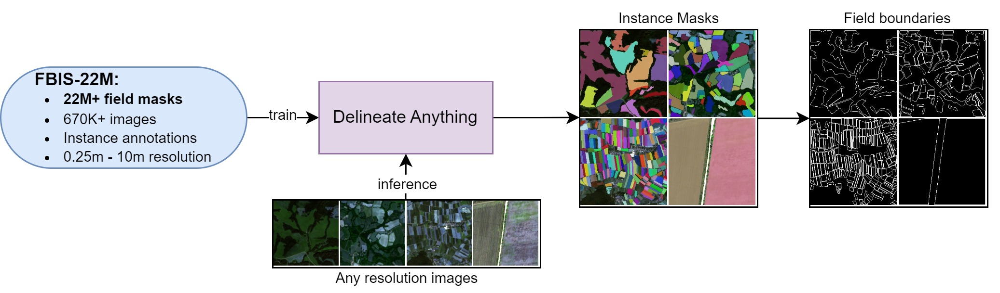

# Delineate Anything: Resolution-Agnostic Field Boundary Delineation on Satellite Imagery
<a href='https://lavreniuk.github.io/Delineate-Anything/'></a> <a href='https://arxiv.org/abs/2504.02534'></a>


by [Mykola Lavreniuk](https://scholar.google.com/citations?hl=en&user=-oFR-RYAAAAJ), [Nataliia Kussul](https://scholar.google.com/citations?user=e3TWBuwAAAAJ&hl=en), [Andrii Shelestov](https://scholar.google.com/citations?user=tqoQKZAAAAAJ&hl=en), [Bohdan Yailymov](https://scholar.google.com/citations?user=XaN-oukAAAAJ&hl=en), [Yevhenii Salii](https://scholar.google.com/citations?user=4jgAsBIAAAAJ&hl=en), [Volodymyr Kuzin](https://www.researchgate.net/profile/Volodymyr-Kuzin), [Zoltan Szantoi](https://scholar.google.com/citations?user=P_pyhi8AAAAJ&hl=en)

> Upcoming Release!
> The code and pre-trained models have been released. The FBIS-22M dataset is currently being prepared for release and will be available here shortly. Please upvote this repository to ensure you don't miss any updates! Stay tuned for more information.

This repository contains PyTorch implementation for paper "Delineate Anything: Resolution-Agnostic Field Boundary Delineation on Satellite Imagery". 

Trained on the 22M+ instances in the FBIS-22M dataset, **Delineate Anything** sets a new SOTA by accurately delineating individual agricultural field boundaries across diverse satellite resolutions and geographic regions.



## 🔗 Pre-trained Models

| Method                 | mAP@0.5 | mAP@0.5:0.95 | Latency (ms) | Size     | Download |
|------------------------|---------|--------------|--------------|----------|----------|
| **Delineate Anything S** | 0.632   | 0.383        | 16.8         | 17.6 MB  | [Download](https://huggingface.co/MykolaL/DelineateAnything/resolve/main/DelineateAnything-S.pt?download=true) |
| **Delineate Anything**   | 0.720   | 0.477        | 25.0         | 125 MB   | [Download](https://huggingface.co/MykolaL/DelineateAnything/resolve/main/DelineateAnything.pt?download=true) |

## ⚙️ Environment Setup

To set up the environment on a Linux system:

```bash
mkdir -p ~/miniconda3
wget https://repo.anaconda.com/miniconda/Miniconda3-latest-Linux-x86_64.sh -O ~/miniconda3/miniconda.sh
bash ~/miniconda3/miniconda.sh -b -u -p ~/miniconda3
rm ~/miniconda3/miniconda.sh

source ~/miniconda3/bin/activate
conda install -c conda-forge gdal

pip install torch==2.6.0
pip install ultralytics==8.3.96
pip install huggingface_hub==0.30.2
```

## 🚀 Inference

1. Place your RGB images into the `images/` folder.  
   _(Three Sentinel-2 sample images are provided for testing.)_

2. Run the inference script:

   ```bash
   python inference.py
   ```
   By default, this will run with the argument ```--model_name DelineateAnything-S.pt```
   To use the large model instead, run:
   ```bash
   python inference.py --model_name DelineateAnything.pt
   ```
   The vectorized field boundaries will be saved as a GeoPackage at:
   ```result/result.gpkg```


ℹ️ Tip: You can adjust MINIMAL_CONFIDENCE in inference.py (currently set to 0.175) to control the sensitivity of field detection. Lower values may detect more boundaries but will increase the inference time.


## License
This project is licensed under the AGPL-3.0 License.

## Acknowledgements
This code is based on [Ultralytics](https://github.com/ultralytics/ultralytics).

## Citation
If you find our work useful in your research, please consider citing:
```
@article{lavreniuk2025delineateanything,
      title={Delineate Anything: Resolution-Agnostic Field Boundary Delineation on Satellite Imagery}, 
      author={Mykola Lavreniuk and Nataliia Kussul and Andrii Shelestov and Bohdan Yailymov and Yevhenii Salii and Volodymyr Kuzin and Zoltan Szantoi},
      year={2025},
      journal={arXiv preprint arXiv:2504.02534},
}
```
