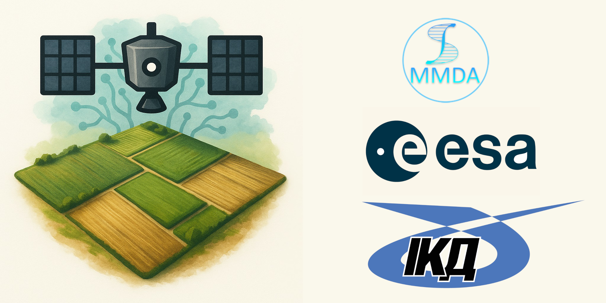

# Delineate Anything: Resolution-Agnostic Field Boundary Delineation on Satellite Imagery
<a href='https://lavreniuk.github.io/Delineate-Anything/'></a>
<a href='https://arxiv.org/abs/2504.02534'></a>
<a href='https://labs-417310.projects.earthengine.app/view/ua2024fields'></a>


<p align="center">
  
</p>


by [Mykola Lavreniuk](https://scholar.google.com/citations?hl=en&user=-oFR-RYAAAAJ), [Nataliia Kussul](https://scholar.google.com/citations?user=e3TWBuwAAAAJ&hl=en), [Andrii Shelestov](https://scholar.google.com/citations?user=tqoQKZAAAAAJ&hl=en), [Bohdan Yailymov](https://scholar.google.com/citations?user=XaN-oukAAAAJ&hl=en), [Yevhenii Salii](https://scholar.google.com/citations?user=4jgAsBIAAAAJ&hl=en), [Volodymyr Kuzin](https://www.researchgate.net/profile/Volodymyr-Kuzin), [Zoltan Szantoi](https://scholar.google.com/citations?user=P_pyhi8AAAAJ&hl=en)

**Delineate Anything** is a resolution-agnostic deep learning framework for accurate agricultural field boundary detection from satellite imagery. Trained on the 22M+ instances in the FBIS-22M dataset, Delineate Anything sets a new SOTA by accurately delineating individual agricultural field boundaries across diverse satellite resolutions and geographic regions.


## 🔗 Pre-trained Models

| Method                 | mAP@0.5 | mAP@0.5:0.95 | Latency (ms) | Size     | Download |
|------------------------|---------|--------------|--------------|----------|----------|
| **Delineate Anything S** | 0.632   | 0.383        | 16.8         | 17.6 MB  | [Download](https://huggingface.co/MykolaL/DelineateAnything/resolve/main/DelineateAnything-S.pt?download=true) |
| **Delineate Anything**   | 0.720   | 0.477        | 25.0         | 125 MB   | [Download](https://huggingface.co/MykolaL/DelineateAnything/resolve/main/DelineateAnything.pt?download=true) |

## ⚙️ Environment Setup

To set up the environment on a Linux system:

```bash
mkdir -p ~/miniconda3
wget https://repo.anaconda.com/miniconda/Miniconda3-latest-Linux-x86_64.sh -O ~/miniconda3/miniconda.sh
bash ~/miniconda3/miniconda.sh -b -u -p ~/miniconda3
rm ~/miniconda3/miniconda.sh

source ~/miniconda3/bin/activate
conda install -c conda-forge gdal

pip install torch==2.6.0
pip install -r requirements.txt
```

To set up the environment on a Windows system:

```bash
conda create --prefix=./.conda python=3.11
conda activate ./.conda
conda install -c conda-forge gdal
pip install torch torchvision torchaudio --index-url https://download.pytorch.org/whl/cu128
pip install -r requirements.txt
```


## 🚀 Inference

1. Place your RGB images in the `data/images/` folder. If available, also include the corresponding land cover map in the `data/masks/`
   _(Three Sentinel-2 sample images and a land cover map are provided for testing.)_

2. Run the inference script:

   ```bash
   python delineate.py -b batch_sample.yaml
   ```
   
   The vectorized field boundaries will be saved as a GeoPackage in:
   ```data/delineated/```

3. (Optional) To shift the resulting vector geometries:
   
   Shift using image pixels:
   ```
   python shift.py -i PATH_TO_SRC_GPKG -o PATH_TO_DST_GPKG -s PATH_TO_SAMPLE_IMAGE -x SHIFT_PIXELS_X -y SHIFT_PIXELS_Y
   ```
   Shift using spatial units (SRS):
   ```
   python shift.py -i PATH_TO_SRC_GPKG -o PATH_TO_DST_GPKG -x SHIFT_UNITS_X -y SHIFT_UNITS_Y
   ```

ℹ️ Tip: For advanced settings, refer to the instructions in [delineation_config_guide.md](delineation_config_guide.md)


## License
This project is licensed under the AGPL-3.0 License.

## Acknowledgements
This code is based on [Ultralytics](https://github.com/ultralytics/ultralytics).

## Citation
If you find our work useful in your research, please consider citing it:
```
@article{lavreniuk2025delineateanything,
      title={Delineate Anything: Resolution-Agnostic Field Boundary Delineation on Satellite Imagery}, 
      author={Mykola Lavreniuk and Nataliia Kussul and Andrii Shelestov and Bohdan Yailymov and Yevhenii Salii and Volodymyr Kuzin and Zoltan Szantoi},
      year={2025},
      journal={arXiv preprint arXiv:2504.02534},
}
```
